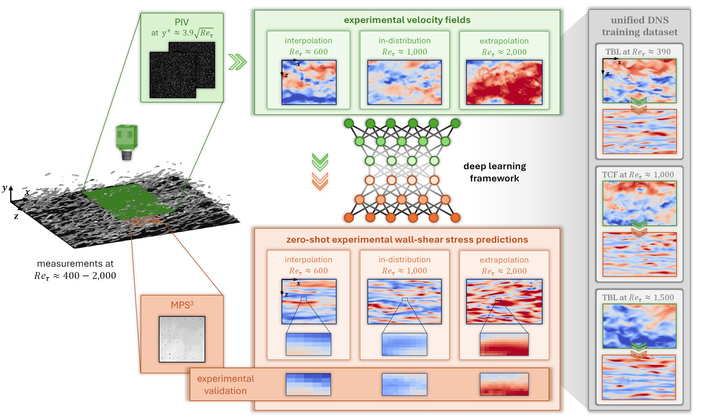

## From numerical training to zero-shot experimental application: A generalized deep learning approach to wall-shear stress quantification



### Overview
This is the official PyTorch implementation of our paper [From numerical training to zero-shot experimental application: A generalized deep learning approach to wall-shear stress quantification](https://doi.org/10.1017/jfm.2025.10150).

## Requirements
The code has been tested with PyTorch 2.4 and Cuda 12.4 on a NVIDIA A100 40Gb.
```Shell
conda create --name WSSprediction
conda activate WSSprediction
conda install pytorch=2.4.0 torchvision=0.19.0 torchaudio=2.4.0 pytorch-cuda=12.4 -c pytorch -c nvidia
pip install h5py=1.14.3 matplotlib=3.9.2 tqdm=4.66.5 prettytable=3.11.0 tensorboard=2.17.1
```

```Shell
python -m venv WSSprediction
source WSSprediction/bin/activate
pip3 install torch==2.6.0 torchvision==0.21.0 torchaudio==2.6.0
pip install h5py==3.13.0 matplotlib==3.10.0 tqdm==4.67.1 prettytable==3.14.0 tensorboard==2.19.0
```

## Pretrained models
Pretrained models for single-configuration (SC) and multi-configuration (MC) can be found on [zenodo](https://doi.org/10.5281/zenodo.15236991). 

SC: Solely trained on a turbulent channel flow at a friction Reynolds number of 1000.
MC: Trained on a combined dataset containing samples from the turbulent channel flow at 1000 and turbulent boundary layer flows at 390 and 1500.
